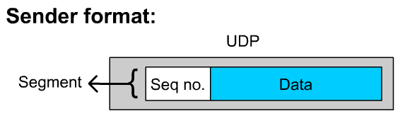
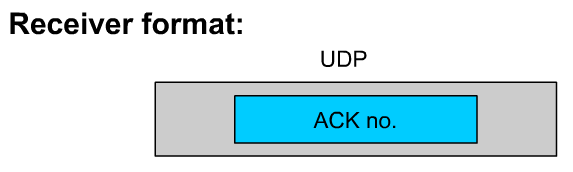
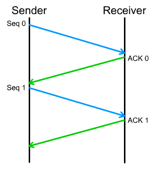
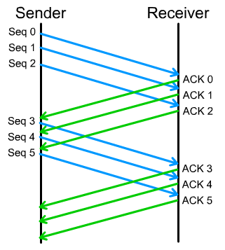
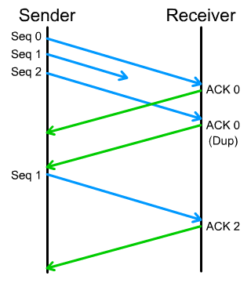
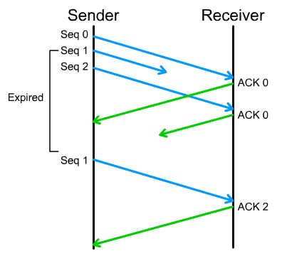

# CS 4254 project 3: TCP Blacksburg
Last updated: December 6, 2022  
Team members: Bug Lee, Maria Pereira  

**Table of Contents:**
- [CS 4254 project 3: TCP Blacksburg](#cs-4254-project-3-tcp-blacksburg)
  - [Project Overview](#project-overview)
- [Part 1: A Reliable Transport Protocol](#part-1-a-reliable-transport-protocol)
  - [1.1 Design Simplification](#11-design-simplification)
  - [1.2 In-order delivery](#12-in-order-delivery)
  - [1.3 Reliability](#13-reliability)
  - [1.4 Summary](#14-summary)
    - [Sender](#sender)
    - [Receiver](#receiver)
- [Part 2: Congestion Control](#part-2-congestion-control)
  - [2.1 Motivation](#21-motivation)
  - [2.2 AIMD](#22-aimd)
  - [2.3 Slow start](#23-slow-start)
  - [2.4 Fast retransmit/recovery](#24-fast-retransmitrecovery)
  - [2.5 Fairness](#25-fairness)
- [Part 3: Test Results](#part-3-test-results)


## Project Overview
The project is divided into two parts. The first part is to implement a simple transport protocol that provides reliable datagram service. The second part is to implement a TCP Reno-like congestion control algorithm.

# Part 1: A Reliable Transport Protocol
## 1.1 Design Simplification
We will borrow some of the approaches from TCP to make a transport protocol. However, according to the project specification, we do not need to consider all the cases that TCP handles, thus, we make simplifications as needed. The following describes the design simplification we can make compared to TCP:

1. **One-way transport**  
Unlike TCP, where both client and server can send and receive data (2-way transport), our simple transport protocol only needs to handle data flowing from sender to receiver. That is, the receiver only needs to worry about sending back an ACK to the sender, without any data.

2. **No three ways handshake and simplified teardown**  
According to project spec, "you do NOT have to implement connection open/close, etc., and may assume that the receiver is run first will wait indefinitely for the sender to send the data to the receiver."

3. **Unbounded receiver's buffer size (receiving window size)**   
In TCP, the receiver's buffer size is generally between 8 KB to 8 MB. So, TCP uses flow control to ensure the sender does not overflow the receiver buffer. For our project, we will not set a limit on the receiver's buffer size.  
However, this still leaves us with the sender's buffer size (sender window size). The sender's buffer size directly affects the number of bytes in flight. If too small, we are filling the pipe only partially, resulting in lower throughput. If too large, the sender will overflow the queues inside the network. For maximal performance, we need to set the sender's buffer size equal to the bottleneck Bandwidth * RTT, Bandwidth delay product (BDP), between sender and receiver. We will handle more of the sender's buffer size in the part 3:Congestino Control.

4. **Error detection**  
The TCP calculates the checksum and includes it inside the header. Since our protocol is built on top of UDP, we will use checksum from UDP and let it handle error detection.

## 1.2 In-order delivery
We first consider how we can deliver segments in order. Like TCP, one way to do this is by attaching a sequence number to each data segment. That way, the receiver knows what segment goes where even when segments get delivered out-of-order. 



The figure above shows the protocol format that the sender would use. we only need to add one header, sequence number, to our segment. 



The protocol format for the receiver is even simpler. From the simplifications, we made in 1.1 and since we are building on top of UDP, we don't need all the fancy headers that TCP uses! Woohoo!

## 1.3 Reliability 
Next, we consider the meat of part 2 of the project: reliability. Reliability can be achieved by **acknowledgments** and **retransmissions**.

Let's first consider the design choice for **acknowledgments**. Each acknowledgment indicates the successful delivery of a certain segment.  
The naive choice would be to implement a stop-and-wait algorithm as shown below.



However, it is clear to see that the throughput of stop and wait would be terrible. We are underutilizing available bandwidth by sending only one segment per RTT. So, like TCP, what we want is the sliding window algorithm.



The above example shows a sliding window algorithm with window size 3 for the sender (As mentioned in 1.1, we will not put bound on the receiver window). That is, the sender can have at most 3 outgoing segments at a time. Once the sender receives ACK0, the sender can remove Seq0 from the window and replace it with Seq3 by sending segment 3 to the receiver. 

Like TCP, we will use cumulative ACKs to keep track of how many in-order segments that receiver successfully received up to and including the ACK number.

Finally, we are ready for **retransmissions**. Retransmission is the heart of reliability since "A transport protocol is reliable if and only if it resends all dropped or corrupted packets".  
When segments get lost or discarded (due to corruption), we might have the following scenario:



The figure above describes the situation when the receiver receives segments 0 and 2, but not 1. Since we are using cumulative ACKs, the receiver store segment 2 on its buffer (window) and then send back another ACK0. Like above, when the sender receives duplicate ACKs, it should retransmit segment 1. Once the receiver finally receives segment 1, it sends back ACK2 since segment 2 was already stored in the buffer.

Another possible scenario is:



In this case, there were no duplicate ACKs, but we see can see that segment 1 was not delivered to the receiver. Like above, the sender should retransmit when it doesn't hear back from the receiver for a certain amount of time.

The above cases are not exhaustive, but we get the idea.

## 1.4 Summary
### Sender
- [x] Protocol format: sequence number + data.
- [x] The sender keeps a list of pending segments. We will call the list the sender window.
- [x] The sender transmits the next segment k when the size of the sender window is smaller than the maximum window size. Then, the sender place the transmitted segment in the sender window.
- [x] When the sender receives an ACK for segment k, the sender removes all segments that have sequence number less than equal to k from the sender window (cumulative ACKs).
- [x] Periodically check and retransmit the expired segment inside the sender window (Not received ACK for that segment after a certain time).

### Receiver
- [x] Protocol format: ACK number.
- [x] When the receiver receives a segment, send back ACK with a sequence number that the receiver has successfully received in-order (cumulative ACKs). 
- [x] The receiver keeps track of a list of received segments. If a duplicate segment arrives, ignore it. We will call the list the receiver window.
- [x] The receiver also keeps track of the next expected segment. When the next expected segment arrives, the receiver print all the in-order segments up to the next hole (missing segment) of the sequence inside the receiver window. 


# Part 2: Congestion Control
## 2.1 Motivation
In part 1, we implemented a reliable transport protocol with a fixed window size. We have observed a few drawbacks to fixing the window size:
1. If the bandwidth-delay product of the bottleneck link on the network is less than the window size, then some packets/segments get dropped at the bottleneck link.
2. If the bandwidth-delay product of the bottleneck link on the network is greater than the window size, then the sender is wasting bandwidth by not fully utilizing the available bandwidth. 
3. Not adapted for multiple senders. One of the senders can leave or a new sender can arrive at any time. Also, each sender might send data at a different rate and the rate may change over time.

To remedy this, we want window size to be adaptive based on the available bandwidth of the bottleneck link and other senders of the network. In other words, we want to minimize drops, minimize delay, and maximize utilization.

## 2.2 AIMD
In most cases, a packet gets lost when there is congestion in the network. So, we used this information to adjust the window size of the sender.

    if Sender received ACK
      W = W + 1
    else timeout
      W = W / 2

This is known as Additive Increase Multiplicative Decrease (AIMD). AIMD allow senders to take into account different number of senders, bandwidth, and load. Being conservative about the increase, but aggressive about the decrease in the face of congestion helps the network to recover from congestion quickly.

## 2.3 Slow start
In the beginning, the sender starts with window size 1 and increases the window as it receives ACKs. However, if the network is mostly free, then additive increase may not utilize bandwidth effectively in the beginning. So instead, the sender starts with the mode where it exponentially increases the window size. This is ironically known as the Slow start. Once the sender detects the first packet loss, then it enters the congestion avoidance mode where AIMD takes place.

## 2.4 Fast retransmit/recovery
TBD

## 2.5 Fairness
For our purpose, we assumed that senders have similar or the same RTTs and loads since all senders and receivers are located inside the same machine and transfer the same file. In such a case, we can expect our CCA will converge to a fair state.

However, each sender may send data at a different rate in practice. For example, consider two senders with different RTTs. The sender with greater RTT will increase the window size slower than the sender with lesser RTT. For another example, one sender may only need to send 1 packet/sec for Pinging whereas another sender needs to send 100 packets/sec for sending a big file. If the network have bottleneck capacity of 2 packets/sec, both senders would send with 1 packet/sec under the current CCA. From these examples, we can see that CCA with AIMD cap the window size without considering different RTTs, loads, etc. So, it is difficult to argue that the current CCA is fair in every senario.


# Part 3: Test Results
The following shows the current output from `testall` script (Nov 16, 2022):
```
Basic (friendly network) tests

  Small 1 Mb/s, 10 ms latency                               [ PASS ]

  Small 0.1 Mb/s 10 ms latency                              [ PASS ]

  Small 0.1 Mb/s 50 ms latency                              [ PASS ]

  Medium 1 Mb/s, 10 ms latency                              [ PASS ]

  Medium 0.1 Mb/s 10 ms latency                             [ PASS ]

  Medium 0.1 Mb/s 50 ms latency                             [ PASS ]

  Large 1 Mb/s, 10 ms latency                               [ PASS ]

  Large 0.5 Mb/s 10 ms latency                              [ PASS ]

  Large 0.1 Mb/s 500 ms latency                             [ PASS ]


Advanced tests

  Small 1Mb/s, 10 ms, 100% duplicate                        [ PASS ]

  Medium 1Mb/s, 10 ms, 50% reorder 10% drop                 [ PASS ]

  Medium 1Mb/s, 10 ms, 50% drop                             [ PASS ]

  Medium 1Mb/s, 10 ms, 50% delay 25% duplicate              [ PASS ]

  Medium 5Mb/s, 10 ms, 5% delay 5% duplicate 5% drop        [ PASS ]

  Large 1Mb/s, 10 ms, 10% delay 10% duplicate               [ PASS ]

  Large 10Mb/s, 10ms, 1% delay 1% duplicate 1% drop         [ PASS ]


Performance tests

  huge 5 Mb/s, 10 ms, 0% drop, 0% duplicate 0% delay        [DATAOK]

    3.864 sec elapsed, 976KB sent

    Rate: 1Mb/s                                             [PERF81]

  large 5 Mb/s, 10 ms, 10% drop, 0% duplicate 0% delay      [DATAOK]

    12.643 sec elapsed, 97KB sent

    Rate: 61Kb/s                                            [ FAIL ]

  large 5 Mb/s, 50 ms, 10% drop, 0% duplicate 0% delay      [DATAOK]

    5.452 sec elapsed, 97KB sent

    Rate: 143Kb/s                                           [PERF4]

  large 10 Mb/s, 25 ms, 10% drop, 10% duplicate 20% delay   [DATAOK]

    2.220 sec elapsed, 97KB sent

    Rate: 351Kb/s                                           [PERF5]

```