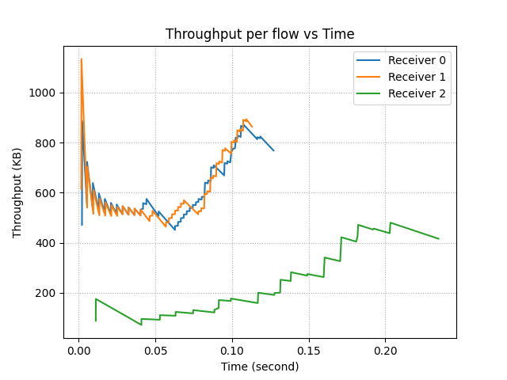
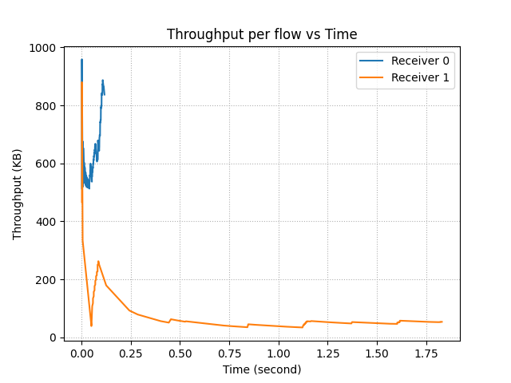
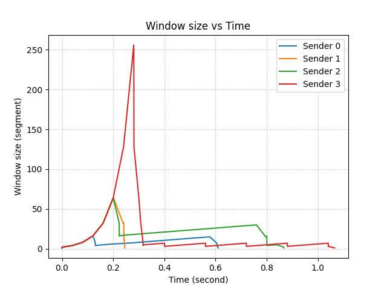
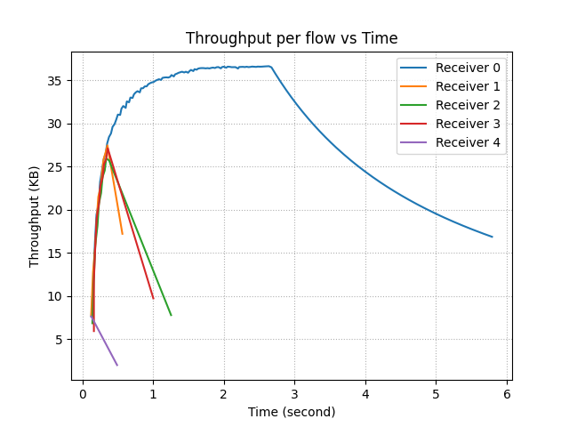
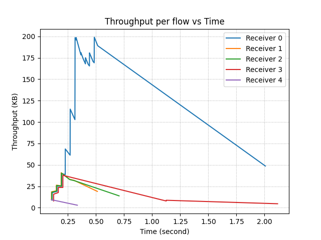

# Simple TCP
Last updated: December 6, 2022  
Team members: Bug Lee, Maria Pereira  

**Table of Contents:**
- [Simple TCP](#simple-tcp)
  - [Project Overview](#project-overview)
- [Part 1: A Reliable Transport Protocol](#part-1-a-reliable-transport-protocol)
  - [1.1 Design Simplification](#11-design-simplification)
  - [1.2 In-order delivery](#12-in-order-delivery)
  - [1.3 Reliability](#13-reliability)
  - [1.4 Summary](#14-summary)
    - [Sender](#sender)
    - [Receiver](#receiver)
- [Part 2: Congestion Control](#part-2-congestion-control)
  - [2.1 Motivation](#21-motivation)
  - [2.2 AIMD](#22-aimd)
  - [2.3 Slow start](#23-slow-start)
  - [2.4 Evaluation of scenario 4: Data center](#24-evaluation-of-scenario-4-data-center)
    - [- 50Mb vs 10 Mb buffer](#--50mb-vs-10-mb-buffer)
    - [- 10Gbps and 1ms vs 100Mbps and 1ms vs 10Gbps and 10ms](#--10gbps-and-1ms-vs-100mbps-and-1ms-vs-10gbps-and-10ms)
    - [- 0% loss rate vs 10% loss rate](#--0-loss-rate-vs-10-loss-rate)
    - [- Four sender-receiver paris sharing same link](#--four-sender-receiver-paris-sharing-same-link)
  - [2.5 CCA performance in other scenarios](#25-cca-performance-in-other-scenarios)
    - [- 90's Internet](#--90s-internet)
    - [- User to CDN](#--user-to-cdn)
    - [- Cross-country](#--cross-country)
- [Part 3: Test Results](#part-3-test-results)


## Project Overview
The project was divided into two parts. The first part was to implement a simple transport protocol that provides reliable datagram service. The second part was to implement a TCP Reno-like congestion control algorithm.

# Part 1: A Reliable Transport Protocol
## 1.1 Design Simplification
We will borrow some of the approaches from TCP to make a transport protocol. However, according to the project specification, we do not need to consider all the cases that TCP handles, thus, we make simplifications as needed. The following describes the design simplification we can make compared to TCP:

1. **One-way transport**  
Unlike TCP, where both client and server can send and receive data (2-way transport), our simple transport protocol only needs to handle data flowing from sender to receiver. That is, the receiver only needs to worry about sending back an ACK to the sender, without any data.

2. **No three ways handshake and simplified teardown**  
According to project spec, "you do NOT have to implement connection open/close, etc., and may assume that the receiver is run first will wait indefinitely for the sender to send the data to the receiver."

3. **Unbounded receiver's buffer size (receiving window size)**   
In TCP, the receiver's buffer size is generally between 8 KB to 8 MB. So, TCP uses flow control to ensure the sender does not overflow the receiver buffer. For our project, we will not set a limit on the receiver's buffer size.  
However, this still leaves us with the sender's buffer size (sender window size). The sender's buffer size directly affects the number of bytes in flight. If too small, we are filling the pipe only partially, resulting in lower throughput. If too large, the sender will overflow the queues inside the network. For maximal performance, we need to set the sender's buffer size equal to the bottleneck Bandwidth * RTT, Bandwidth delay product (BDP), between sender and receiver. We will handle more of the sender's buffer size in the part 3:Congestino Control.

4. **Error detection**  
The TCP calculates the checksum and includes it inside the header. Since our protocol is built on top of UDP, we will use checksum from UDP and let it handle error detection.

## 1.2 In-order delivery
We first consider how we can deliver segments in order. Like TCP, one way to do this is by attaching a sequence number to each data segment. That way, the receiver knows what segment goes where even when segments get delivered out-of-order. 


The figure above shows the protocol format that the sender would use. we only need to add one header, sequence number, to our segment. 


The protocol format for the receiver is even simpler. From the simplifications, we made in 1.1 and since we are building on top of UDP, we don't need all the fancy headers that TCP uses! Woohoo!

## 1.3 Reliability 
Next, we consider the meat of part 2 of the project: reliability. Reliability can be achieved by **acknowledgments** and **retransmissions**.

Let's first consider the design choice for **acknowledgments**. Each acknowledgment indicates the successful delivery of a certain segment.  
The naive choice would be to implement a stop-and-wait algorithm as shown below.


However, it is clear to see that the throughput of stop and wait would be terrible. We are underutilizing available bandwidth by sending only one segment per RTT. So, like TCP, what we want is the sliding window algorithm.


The above example shows a sliding window algorithm with window size 3 for the sender (As mentioned in 1.1, we will not put bound on the receiver window). That is, the sender can have at most 3 outgoing segments at a time. Once the sender receives ACK0, the sender can remove Seq0 from the window and replace it with Seq3 by sending segment 3 to the receiver. 

Like TCP, we will use cumulative ACKs to keep track of how many in-order segments that receiver successfully received up to and including the ACK number.

Finally, we are ready for **retransmissions**. Retransmission is the heart of reliability since "A transport protocol is reliable if and only if it resends all dropped or corrupted packets".  
When segments get lost or discarded (due to corruption), we might have the following scenario:


The figure above describes the situation when the receiver receives segments 0 and 2, but not 1. Since we are using cumulative ACKs, the receiver store segment 2 on its buffer (window) and then send back another ACK0. Like above, when the sender receives duplicate ACKs, it should retransmit segment 1. Once the receiver finally receives segment 1, it sends back ACK2 since segment 2 was already stored in the buffer.

Another possible scenario is:


In this case, there were no duplicate ACKs, but we see can see that segment 1 was not delivered to the receiver. Like above, the sender should retransmit when it doesn't hear back from the receiver for a certain amount of time.

The above cases are not exhaustive, but we get the idea.

## 1.4 Summary
### Sender
- [x] Protocol format: sequence number + data.
- [x] The sender keeps a list of pending segments. We will call the list the sender window.
- [x] The sender transmits the next segment k when the size of the sender window is smaller than the maximum window size. Then, the sender place the transmitted segment in the sender window.
- [x] When the sender receives an ACK for segment k, the sender removes all segments that have sequence number less than equal to k from the sender window (cumulative ACKs).
- [x] Periodically check and retransmit the expired segment inside the sender window (Not received ACK for that segment after a certain time).

### Receiver
- [x] Protocol format: ACK number.
- [x] When the receiver receives a segment, send back ACK with a sequence number that the receiver has successfully received in-order (cumulative ACKs). 
- [x] The receiver keeps track of a list of received segments. If a duplicate segment arrives, ignore it. We will call the list the receiver window.
- [x] The receiver also keeps track of the next expected segment. When the next expected segment arrives, the receiver print all the in-order segments up to the next hole (missing segment) of the sequence inside the receiver window. 


# Part 2: Congestion Control
## 2.1 Motivation
In CP2, we implemented a reliable transport protocol with a fixed window size. However, we have observed a few drawbacks to fixing the window size:
1. If the bandwidth-delay product of the bottleneck link on the network is less than the window size, then packets/segments get dropped at the bottleneck link.
2. If the bandwidth-delay product of the bottleneck link on the network is greater than the window size, then the sender is wasting bandwidth by not fully utilizing the available bandwidth. 
3. Not adapted for multiple senders. One of the senders can leave or a new sender can arrive at any time. Also, each sender might send data at a different rate and the rate may change over time.

To remedy this, we have implemented CCA to adjust window size based on the available bandwidth of the bottleneck link and other senders of the network. 

## 2.2 AIMD
We assumed that a packet gets lost when there is congestion in the network. We considered two cases for lost packets: (1) received duplicated ACKs, or (2) a timeout occurred. Like TCP, we have used AIMD to be conservative for increasing window size, but aggressive for decreasing window size when congestion is detected.

    W = W + 1
    if Dup ACKs or timeout
      W = W / 2

## 2.3 Slow start
Like TCP, we implemented the sender to start with the slow start mode, exponential increase in window size instead of a linear increase. Once the sender detects the first packet loss, then it enters the congestion avoidance mode.

## 2.4 Evaluation of scenario 4: Data center 
The following parameters were used to simulate the data center: 1ms latency, 10Gbps bandwidth, 0% loss, and 50Mb queue. We have used a large file (100KB) for all tests except the test for multiple sender-receiver pairs which uses a huge file (1MB).

### - 50Mb vs 10 Mb buffer 
Sender 0 was tested with a 10Mb buffer whereas sender 1 was tested with 50Mb (Figures 1 and 2). Since there cannot be an issue with overflowing the buffer with a 100KB file, we expected no difference in performance. As expected, the buffer size had minimal impact on the performance in this case.  


<p align="center"> Figure 1 and 2. </p>

### - 10Gbps and 1ms vs 100Mbps and 1ms vs 10Gbps and 10ms 
The sender 0 was tested under the original data center simulation. On the other hand, sender 1 was tested with lower bandwidth whereas sender 2 was tested with a longer delay (Figures 3 and 4). We have observed that changing bandwidth does not affect performance as long as we have a bandwidth greater than 100 KB. On the other hand, we found that higher latency causes lower throughput no matter how large the bandwidth is. One aspect that is lacking in our implementation is the additive increase based on RTT. In general, the sender with greater RTT will increase the size of the window slower than the sender with lesser RTT.



<p align="center"> Figure 3 and 4. </p>

### - 0% loss rate vs 10% loss rate
The sender 0 was tested under the original data center simulation. On the other hand, sender 1 was tested with a higher drop rate (Figures 5 and 6). Since packet drop usually happens when there is congestion, we can see that CCA has performed as expected. As shown below, our CCA maintains the window size to not to overwhelm the network.



<p align="center"> Figure 5 and 6. </p>

### - Four sender-receiver paris sharing same link 
The sender 0 to 3 was tested under the original data center simulation (Figures 7 and 8) using the same file size. In the figure below, we can see that receiver 2 (green) and receiver 3 (red) start slow, but CCA assigns more window sizes to corresponding senders. As a result, we can see that throughput of receiver 2 and receiver 3 increase rapidly around 0.2 seconds whereas the throughput of receiver 1 (blue) is maintained. Once receivers 2 and 3 have more throughput than the receiver 0, the roles are reversed.



<p align="center"> Figure 7 and 8. </p>

## 2.5 CCA performance in other scenarios
In the following examples, we have created a situation where 
- sender/receiver 0 pair exchange a large (100KB) file
- sender/receiver 1,2, and 3 pairs each exchange a medium (10KB) file
- sender/receiver 4 pair exchange a small (1KB) file

where multi-pairs are sharing the same link in each specified situation below.

From these experiments, we found that our CCA showcases proportional fairness. That is, our CCA was good at assigning more window size based on the size of the data needed to transfer, instead of assigning an equal amount of window size to all senders. We can see that the resulting throughput matches the corresponding window size. One interesting result was CDN, where the sender/receiver 0 pair finished transferring more than most of the other pairs despite it was sending the most bytes. This was also the case for the Datacenter, so we concluded that our CCA gives priority to bigger data when there is high bandwidth and low latency is available. 

### - 90's Internet 


<p align="center"> Figure 9 and 10. </p>

### - User to CDN 


<p align="center"> Figure 11 and 12. </p>

### - Cross-country


<p align="center"> Figure 13 and 14. </p>


# Part 3: Test Results
The following shows the current output from `testall` script (Nov 16, 2022):
```
Basic (friendly network) tests

  Small 1 Mb/s, 10 ms latency                               [ PASS ]

  Small 0.1 Mb/s 10 ms latency                              [ PASS ]

  Small 0.1 Mb/s 50 ms latency                              [ PASS ]

  Medium 1 Mb/s, 10 ms latency                              [ PASS ]

  Medium 0.1 Mb/s 10 ms latency                             [ PASS ]

  Medium 0.1 Mb/s 50 ms latency                             [ PASS ]

  Large 1 Mb/s, 10 ms latency                               [ PASS ]

  Large 0.5 Mb/s 10 ms latency                              [ PASS ]

  Large 0.1 Mb/s 500 ms latency                             [ PASS ]


Advanced tests

  Small 1Mb/s, 10 ms, 100% duplicate                        [ PASS ]

  Medium 1Mb/s, 10 ms, 50% reorder 10% drop                 [ PASS ]

  Medium 1Mb/s, 10 ms, 50% drop                             [ PASS ]

  Medium 1Mb/s, 10 ms, 50% delay 25% duplicate              [ PASS ]

  Medium 5Mb/s, 10 ms, 5% delay 5% duplicate 5% drop        [ PASS ]

  Large 1Mb/s, 10 ms, 10% delay 10% duplicate               [ PASS ]

  Large 10Mb/s, 10ms, 1% delay 1% duplicate 1% drop         [ PASS ]


Performance tests

  huge 5 Mb/s, 10 ms, 0% drop, 0% duplicate 0% delay        [DATAOK]

    3.864 sec elapsed, 976KB sent

    Rate: 1Mb/s                                             [PERF81]

  large 5 Mb/s, 10 ms, 10% drop, 0% duplicate 0% delay      [DATAOK]

    12.643 sec elapsed, 97KB sent

    Rate: 61Kb/s                                            [ FAIL ]

  large 5 Mb/s, 50 ms, 10% drop, 0% duplicate 0% delay      [DATAOK]

    5.452 sec elapsed, 97KB sent

    Rate: 143Kb/s                                           [PERF4]

  large 10 Mb/s, 25 ms, 10% drop, 10% duplicate 20% delay   [DATAOK]

    2.220 sec elapsed, 97KB sent

    Rate: 351Kb/s                                           [PERF5]

```