# CS 4254 project 3: CP3 CCA Evaluation

## 1. Motivation
In CP2, we implemented a reliable transport protocol with a fixed window size. However, we have observed a few drawbacks to fixing the window size:
1. If the bandwidth-delay product of the bottleneck link on the network is less than the window size, then packets/segments get dropped at the bottleneck link.
2. If the bandwidth-delay product of the bottleneck link on the network is greater than the window size, then the sender is wasting bandwidth by not fully utilizing the available bandwidth. 
3. Not adapted for multiple senders. One of the senders can leave or a new sender can arrive at any time. Also, each sender might send data at a different rate and the rate may change over time.
   
To remedy this, we have implemented CCA to adjust window size based on the available bandwidth of the bottleneck link and other senders of the network. 

## 2. AIMD
We assumed that a packet gets lost when there is congestion in the network. We considered two cases for lost packets: (1) received duplicated ACKs, or (2) a timeout occurred. Like TCP, we have used AIMD to be conservative for increasing window size, but aggressive for decreasing window size when congestion is detected.

    W = W + 1
    if Dup ACKs or timeout
      W = W / 2

## 3. Slow start
Like TCP, we implemented the sender to start with the slow start mode, exponential increase in window size instead of a linear increase. Once the sender detects the first packet loss, then it enters the congestion avoidance mode.

## 4. Evaluation of scenario 4: Datacenter 
The following parameters were used to simulate the data center: 1ms latency, 10Gbps bandwidth, 0% loss, and 50Mb queue. We have used a large file (100KB) for all tests except the test for multiple sender-receiver pairs which uses a huge file (1MB).

### - 50Mb vs 10 Mb buffer 
Sender 0 was tested with a 10Mb buffer whereas sender 1 was tested with 50Mb (Figures 1 and 2). Since there cannot be an issue with overflowing the buffer with a 100KB file, we expected no difference in performance. As expected, the buffer size had minimal impact on the performance in this case.  

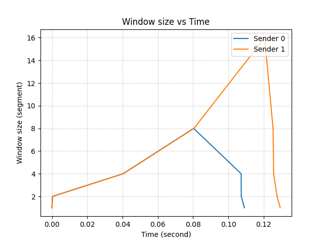
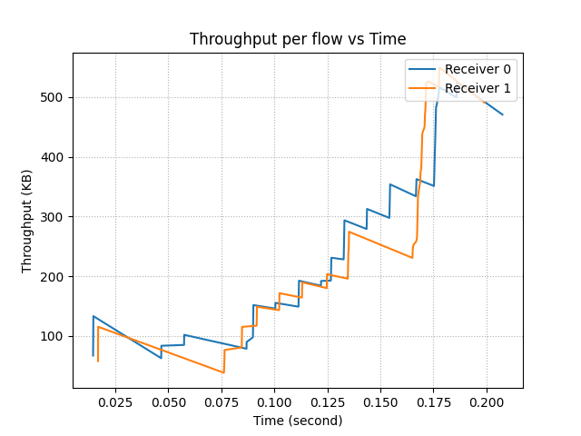

 Figure 1 and 2. 

### - 10Gbps and 1ms vs 100Mbps and 1ms vs 10Gbps and 10ms 
The sender 0 was tested under the original data center simulation. On the other hand, sender 1 was tested with lower bandwidth whereas sender 2 was tested with a longer delay (Figures 3 and 4). We have observed that changing bandwidth does not affect performance as long as we have a bandwidth greater than 100 KB. On the other hand, we found that higher latency causes lower throughput no matter how large the bandwidth is. One aspect that is lacking in our implementation is the additive increase based on RTT. In general, the sender with greater RTT will increase the size of the window slower than the sender with lesser RTT.

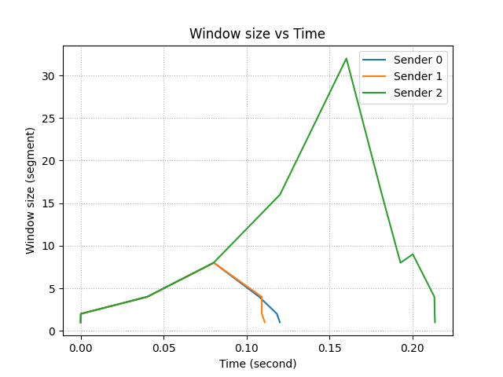
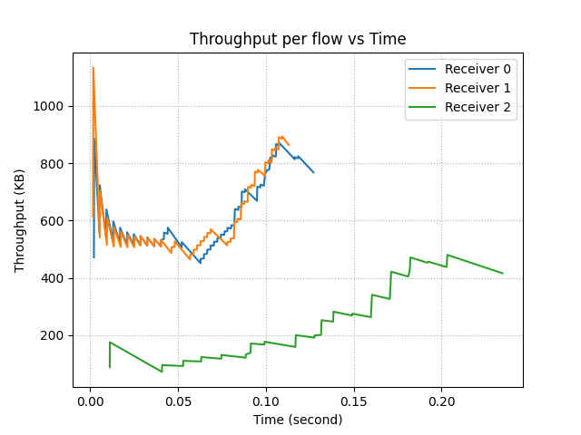

 Figure 3 and 4. 

### - 0% loss rate vs 10% loss rate
The sender 0 was tested under the original data center simulation. On the other hand, sender 1 was tested with a higher drop rate (Figures 5 and 6). Since packet drop usually happens when there is congestion, we can see that CCA has performed as expected. As shown below, our CCA maintains the window size to not to overwhelm the network.

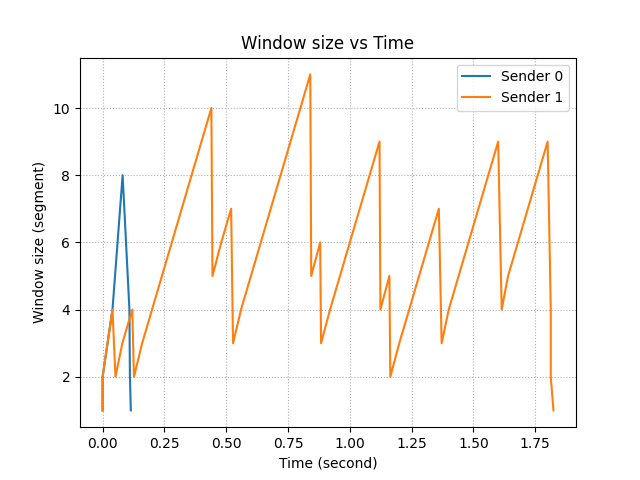
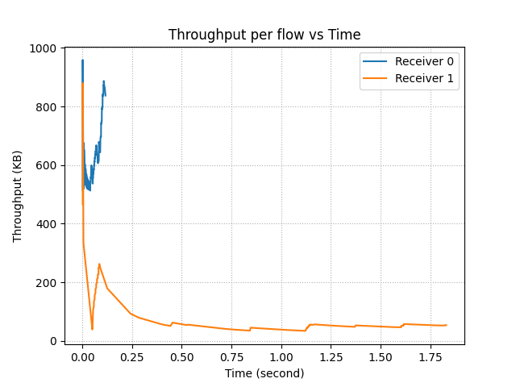

 Figure 5 and 6. 

### - Four sender-receiver paris sharing same link 
The sender 0 to 3 was tested under the original data center simulation (Figures 7 and 8) using the same file size. In the figure below, we can see that receiver 2 (green) and receiver 3 (red) start slow, but CCA assigns more window sizes to corresponding senders. As a result, we can see that throughput of receiver 2 and receiver 3 increase rapidly around 0.2 seconds whereas the throughput of receiver 1 (blue) is maintained. Once receivers 2 and 3 have more throughput than the receiver 0, the roles are reversed.

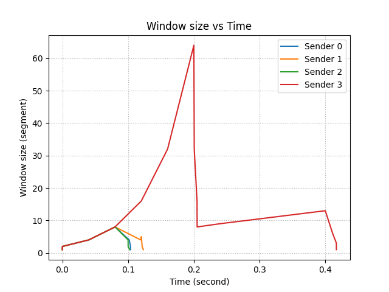
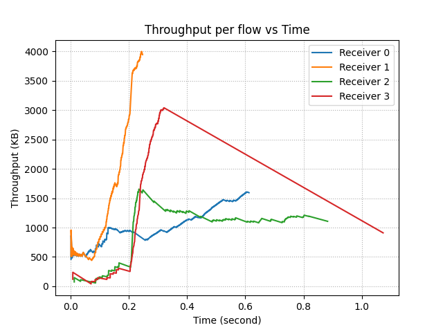

 Figure 7 and 8. 

## 5. CCA performance in other senarios
### - 90's Internet 
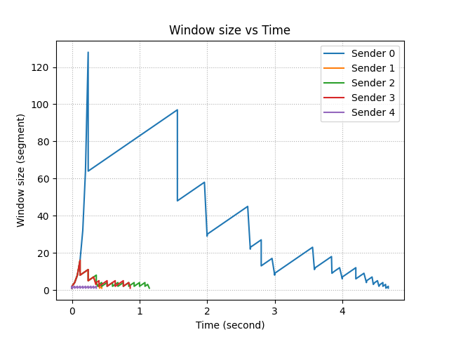
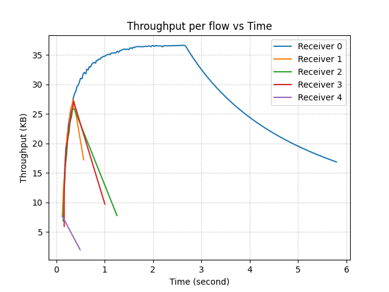

 Figure 9 and 10. 

### - User to CDN 
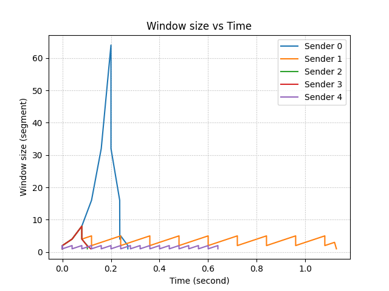
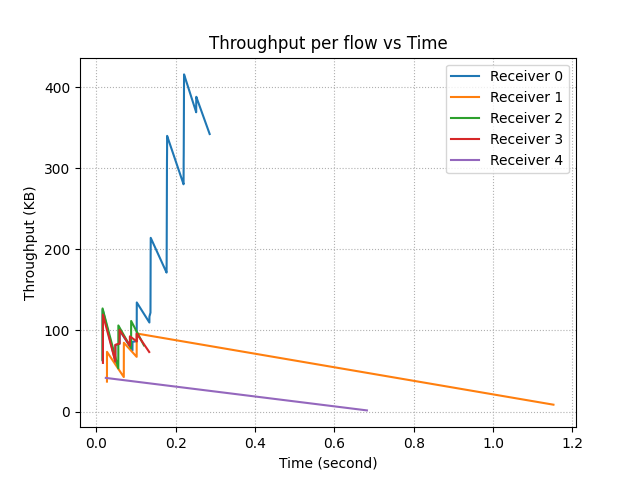

 Figure 11 and 12. 

### - Cross-country
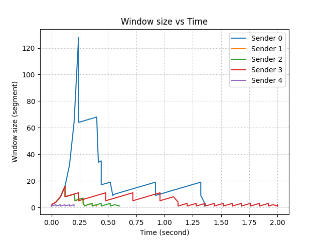
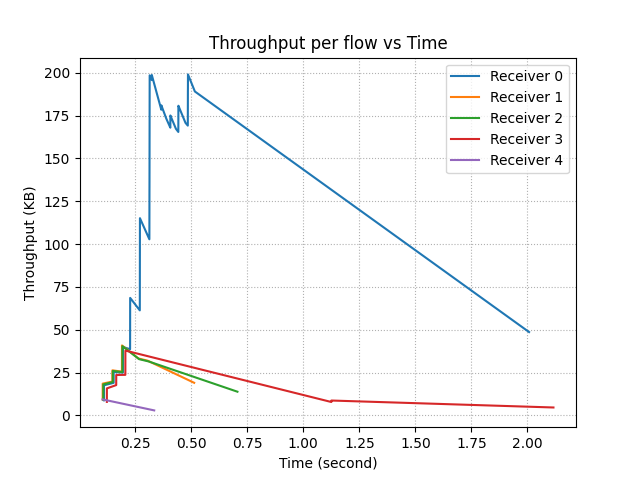

 Figure 13 and 14. 

