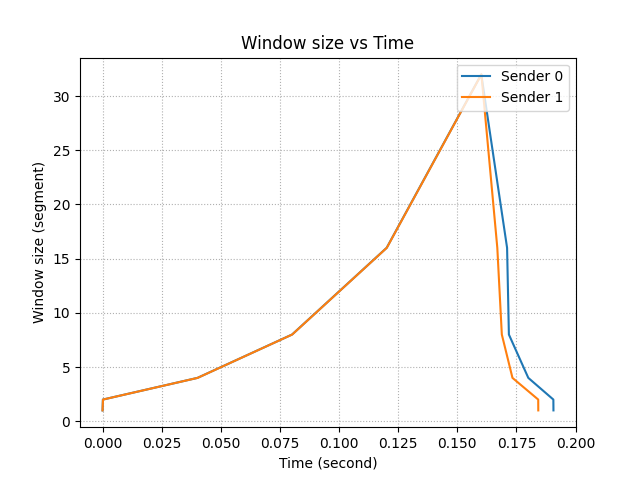

# CS 4254 project 3: CP3 CCA Evaluation

## 1. Motivation
In CP2, we implemented a reliable transport protocol with a fixed window size. However, we have observed a few drawbacks to fixing the window size:
1. If the bandwidth-delay product of the bottleneck link on the network is less than the window size, then packets/segments get dropped at the bottleneck link.
2. If the bandwidth-delay product of the bottleneck link on the network is greater than the window size, then the sender is wasting bandwidth by not fully utilizing the available bandwidth. 
3. Not adapted for multiple senders. One of the senders can leave or a new sender can arrive at any time. Also, each sender might send data at a different rate and the rate may change over time.
   
To remedy this, we have implemented CCA to adjust window size based on the available bandwidth of the bottleneck link and other senders of the network. 

## 2. AIMD
We assumed that a packet gets lost when there is congestion in the network. We considered two cases for lost packet: (1) recevied duplicated ACKs, or (2) timeout occured. Like TCP, we have used AIMD to be conservative for increasing window size, but aggresive for decreaseing window size when cogestion is detected.

    W = W + 1
    if Dup ACKs or timeout
      W = W / 2

## 3. Slow start
Like TCP, we implemented the sender to starts with the slow start mode, exponential increase in window size instead of linear increase. Once the sender detects the first packet loss, then it enters the congestion avoidance mode.

## 4. Evalution of scenario 4: Data center 
The following parameters were used to simulate data center: 1ms latency, 10Gbps bandwidth, 0% loss, 50Mb queue. We have used Large file (100KB) for all tests.

### - 50Mb vs 10 Mb buffer 
The sender 0 was tested with 10Mb buffer whereas sender 1 was tested with 50Mb (Figure 1 and 2).

Figure 1 and 2.

### - 10Gbps and 1ms vs 100Mbps and 1ms vs 10Gbps and 10ms 
The sender 0 was tested under original data center simulation. On the other hand, the sender 1 was tested with lower bandwidth whereas the sender 2 was tested with longer delay (Figure 3 and 4).

Figure 3 and 4.

### - 0% loss rate vs 10% loss rate
The sender 0 was tested under original data center simulation. On the other hand, the sender 1 was tested with higher drop rate (Figure 5 and 6).

Figure 5 and 6.

### - Four sender-receiver paris sharing same link 
The sender 0 to 3 was tested under original data center simulation (Figure 7 and 8).

Figure 7 and 8.

## 5. CCA performance in other senarios
### - 90's Internet 

Figure 9 and 10.

### - User to CDN 

Figure 11 and 12.

### - Cross-country

Figure 13 and 14.

## 4. Additional notes on fairness
Each sender may send data at a different rate in practice. For example, consider two senders with different RTTs. The sender with greater RTT will increase the window size slower than the sender with lesser RTT. For another example, one sender may only need to send 1 packet/sec for Pinging whereas another sender needs to send 100 packets/sec for sending a big file. If the network have bottleneck capacity of 2 packets/sec, both senders would send with 1 packet/sec under the current CCA. From these examples, we can see that CCA with AIMD cap the window size without considering different RTTs, loads, etc. So, it is difficult to argue that the current CCA is fair.